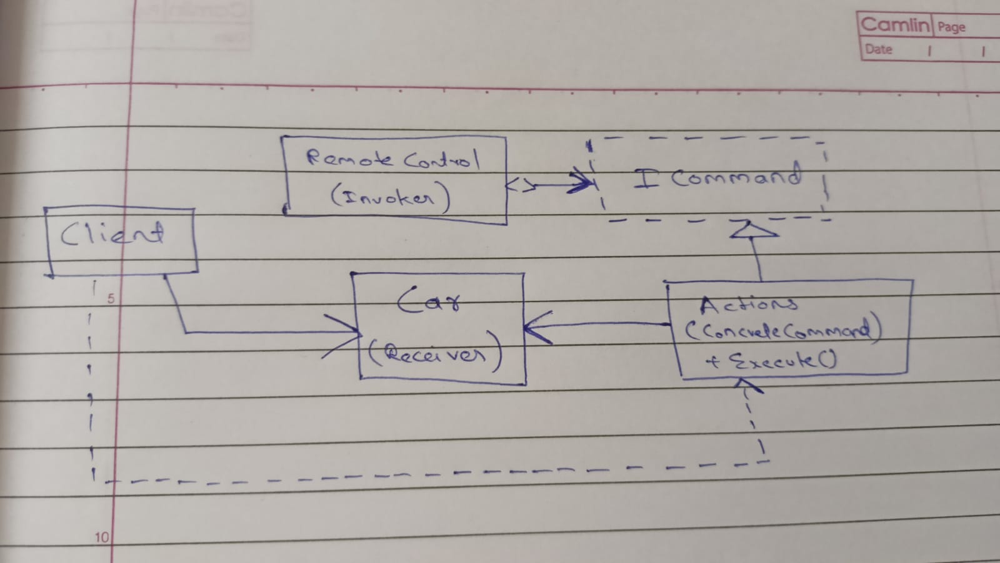

# CommandDesignPattern

## Overview

This project aims to demonstrate the **Command design pattern** in C#. The Command design pattern is a behavioral design pattern that focuses on encapsulating a request as an object, thereby allowing for the parameterization of clients with queues, requests, and operations. It transforms a request into a standalone object with its own class, containing necessary information about the request, and can be passed around and executed independently from the sender and the receiver.

## Remote Control Car
The example we're using to demonstrate the Command Design Pattern is that of a remote-controlled car. It emulates the operation of a remote control car in action. This real-world scenario is used to showcase how the Command Pattern effectively decouples the sender (the remote control) from the receiver (the car) and encapsulates various actions as command objects.

## Components Involved

- **Command** : Declares an interface for executing an operation. *ICommand* is used here as the interface.
- **Receiver** : Carries out the actual operations associated with performing the request. *Car* is our Receiver object here. It contains methods like *MoveForward()*, *MoveLeft()*, *MoveRight()*, and *Stop()*, which define how the car behaves in response to commands.
- **ConcreteCommand** : Defines a binding between the Receiver object and a corresponding action. It implements the *Execute()* function by invoking the corresponding operation(s) on Receiver. The classes in the *Actions* directory are our ConcreteCommand classes.
- **Invoker** : The *RemoteControl* class is our invoker here. It contains switches that correspond to different commands that can be set. When clicked, *RemoteControl* invokes the corresponding command without knowing the details of how the command is executed.

## Class diagram

